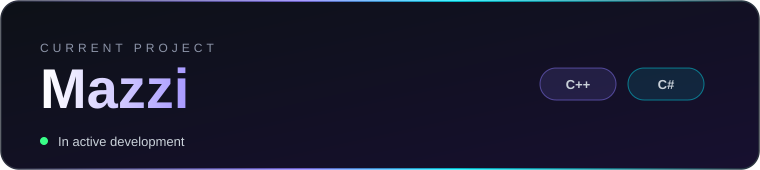

 

### ABOUT

I build efficient, scalable software in **C++**, **C#** and **JavaScript**. 
I care about performance, clean architecture, and how systems work under the hood.

  

 

### CURRENT PROJECT

  

 

### STACK

  

**Visual Studio** &nbsp;Expert &nbsp;·&nbsp; **C#** &nbsp;Advanced &nbsp;·&nbsp; **C++** &nbsp;Advanced &nbsp;·&nbsp; **JavaScript** &nbsp;Experienced

  

 

### STATS

  

  

 

